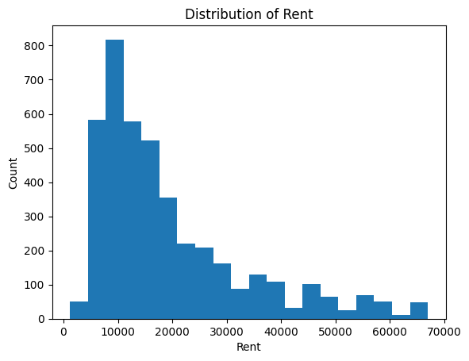
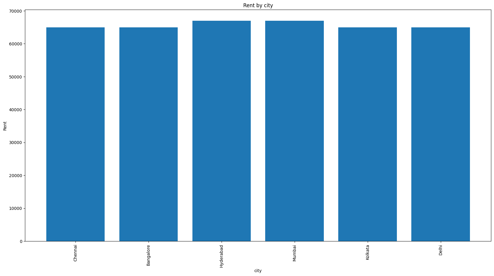
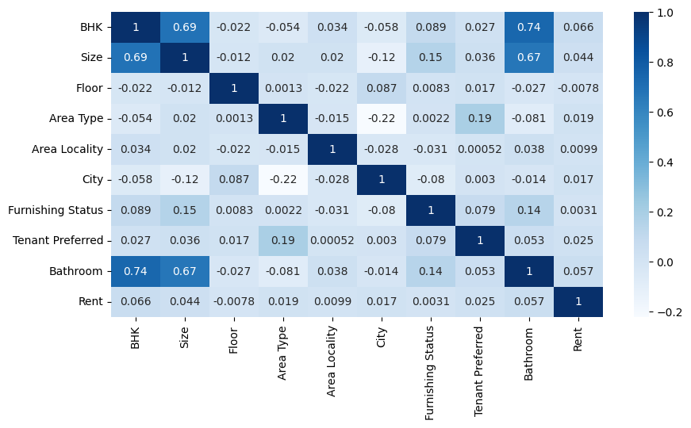

# House Rent Prediction

## Overview
This project analyzes house rent data and predicts rental prices using Machine Learning techniques.

## Technologies Used
- Python
- Pandas
- NumPy
- Matplotlib
- Seaborn
- Scikit-learn
- XGBoost

## Features
- Data Cleaning
- Exploratory Data Analysis (EDA)
- Data Visualization
- House Rent Prediction

## Project Screenshots

## Author
Mohamed Ahmed
